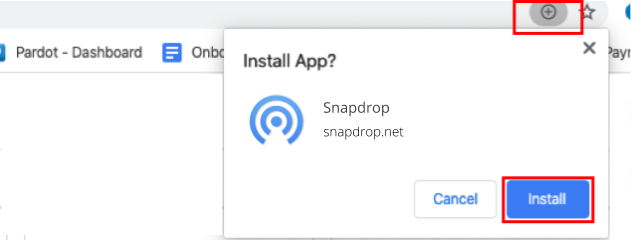

# Frequently Asked Questions

### Instructions / Discussions
* [Video Instructions](https://www.youtube.com/watch?v=4XN02GkcHUM) (Big thanks to [TheiTeckHq](https://www.youtube.com/channel/UC_DUzWMb8gZZnAbISQjmAfQ))
* [idownloadblog](http://www.idownloadblog.com/2015/12/29/snapdrop/)
* [thenextweb](http://thenextweb.com/insider/2015/12/27/snapdrop-is-a-handy-web-based-replacement-for-apples-fiddly-airdrop-file-transfer-tool/)
* [winboard](http://www.winboard.org/artikel-ratgeber/6253-dateien-vom-desktop-pc-mit-anderen-plattformen-teilen-mit-snapdrop.html)
* [免費資源網路社群](https://free.com.tw/snapdrop/)
* [Hackernews](https://news.ycombinator.com/front?day=2020-12-24)
* [Reddit](https://www.reddit.com/r/Android/comments/et4qny/snapdrop_is_a_free_open_source_cross_platform/)
* [Producthunt](https://www.producthunt.com/posts/snapdrop)

### Help! I can't install the PWA!
if you are using a Chromium-based browser (Chrome, Edge, Brave, etc.), you can easily install Snapdrop PWA on your desktop by clicking the install button in the top-right corner while on [snapdrop.net](https://snapdrop.net) (see below).

### What about the connection? Is it a P2P-connection directly from device to device or is there any third-party-server?
It uses a P2P connection if WebRTC is supported by the browser. WebRTC needs a Signaling Server, but it is only used to establish a connection and is not involved in the file transfer.

### What about privacy? Will files be saved on third-party-servers?
None of your files are ever sent to any server. Files are sent only between peers. Snapdrop doesn't even use a database. If you are curious have a look [at the Server](https://github.com/RobinLinus/snapdrop/blob/master/server/). Even if Snapdrop was able to view the files being transfered, WebRTC encrypts the files on transit, so the server would be unable to read them.

### What about security? Are my files encrypted while being sent between the computers?
Yes. Your files are sent using WebRTC, which encrypts them on transit.

### Why don't you implement feature xyz?
Snapdrop is a study in radical simplicity. The user interface is insanely simple. Features are chosen very carefully because complexity grows quadratically since every feature potentially interferes with each other feature. We focus very narrowly on a single use case: instant file transfer. 
We are not trying to optimize for some edge-cases. We are optimizing the user flow of the average users. Don't be sad if we decline your feature request for the sake of simplicity. 

If you want to learn more about simplicity you can read [Insanely Simple: The Obsession that Drives Apple's Success](https://www.amazon.com/Insanely-Simple-Ken-Segall-audiobook/dp/B007Z9686O) or [Thinking, Fast and Slow](https://www.amazon.com/Thinking-Fast-Slow-Daniel-Kahneman/dp/0374533555).

### Snapdrop is awesome! How can I support it? 
* [Donate via PayPal to help cover the server costs](https://www.paypal.com/donate/?hosted_button_id=FTP9DXUR7LA7Q)
* [File bugs, give feedback, submit suggestions](https://github.com/RobinLinus/snapdrop/issues)
* Share Snapdrop on your social media.
* Fix bugs and make a pull request. 
* Do security analysis and suggestions

## Third-Party Apps
Here's a list of some third-party Snapdrop apps:

1. [Snapdrop Desktop App](https://github.com/alextwothousand/snapdrop-desktop) built on top of Electron. (Thanks to [alextwothousand!](https://github.com/alextwothousand/)).

1. [Snapdrop Android App](https://github.com/fm-sys/snapdrop-android) allows you to also send files directly from other apps via the share action.

1. [Snapdrop Flutter App](https://github.com/congnguyendinh0/snapdrop_flutter)

1. [Snapdrop iOS App](https://github.com/CDsigma/Snapdrop-iOS-App)

1. [Snapdrop Node App (with completely Node server)](https://github.com/Bellisario/node-snapdrop)

1. [SnapDrop VSCode Extension](https://github.com/Yash-Garg/snapdrop-vsc)

1. Feel free to make one :)

[< Back](/README.md)
